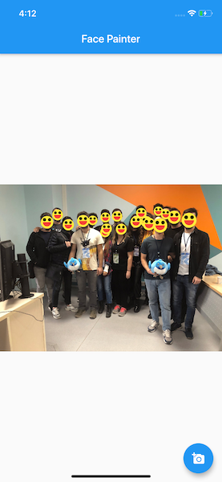

A Flutter example that makes everybody smile in a picture using Canvas and Firebase ML Kit. 
This example is based on this video:  [Custom painting in Flutter - Flutter In Focus](https://www.youtube.com/watch?v=vvI_NUXK00s)

## Setup
Please follow the guide below to setup a Firebase project and add it to your project. After doing that, you can build and run.
[https://firebase.google.com/docs/flutter/setup](https://firebase.google.com/docs/flutter/setup)